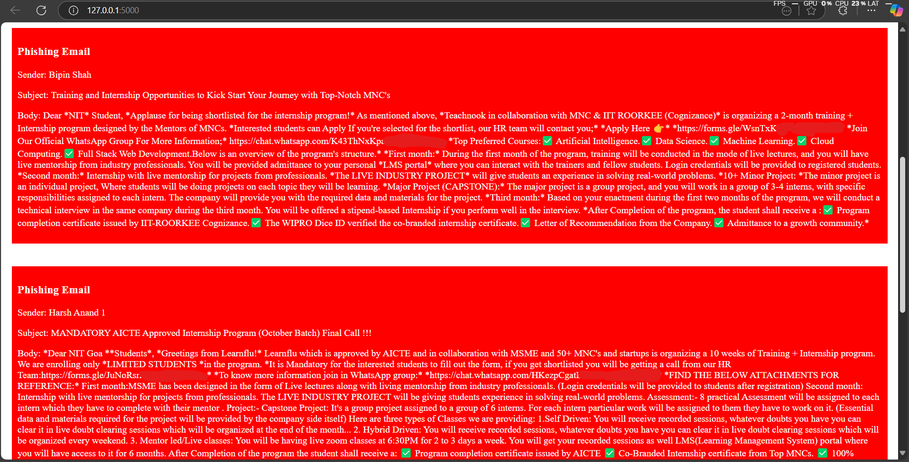

# PS2: AI-Powered Phishing Detection and Mitigation
## Prerequisites:
1. **Python:** In order to run this script, you would need Python and PIP to be installed on your device. [Click Here to Download Python](http://www.python.org/)
2. **Storage Space:** You would need about 2GB of storage space to download the [pre-trained BERT Phishing Model](https://huggingface.co/ealvaradob/bert-finetuned-phishing) used for this project and its dependencies.
3. **Gmail OAuth Credentials:** You would need Google Cloud Console OAuth Credentials in order to get the Gmail API and use it in your application.

## Getting the OAuth Credentials:
1. Go to [Google Cloud Console](https://console.cloud.google.com/) and login with your Gmail account. Create an organization (optional) and click Create a Project. Give it any name and click continue.
2. In your project, in the search bar at the top, search for "Gmail API". Click on "Enable".
3. Again using the search bar, search for "APIs and Services". In the left side menu, click on OAuth Consent Screen.
4. Click on External and click on Create.
5. Give it an App Name, Developer Email Address, and click Save and Continue.
6. In the scopes, click on "Add or Remove Scopes" and search for Gmail API (will only be shown if the API is enabled as said in the previous steps), and check the ".../auth/gmail.readonly" scope.
7. As this application is not verified and not yet published, the project will only work for a few test users. Enter the email addresses you want to use this project on.
8. Finally click on "Save".
9. Now in the "APIs and Services" section, go to the "Credentials" page using the left side menu, and click on "+ Create Credentials", select "OAuth Client ID", and select "Desktop Application". Give it a name and click on "Create".
10. Now, download the credentials JSON file and rename the file to "creds.json". Put the file in the source folder of this project.

## Python Dependencies:
The following python modules are required to be downloaded for executing this script.
```bash
$ pip install os torch transformers pickle requests base64 flask beautifulsoup4 google-api-python-client google-auth-httplib2 google-auth-oauthlib
```
The requirement for the above modules in the script is mentioned here:
- **os:** Required to get the file directory in order to get the creds.json and token.pickle files.
- **torch and transformers:** Required for the pre-trained BERT Phishing Model.
- **pickle:** Required to dump the user credentials in a encoded file and retreiving them.
- **requests:** Required for getting the Phishing URL Database.
- **base64:** Required for decoding the body of the mail message.
- **flask:** Required for a simple frontend using python.
- **beautifulsoup4:** Required to get the body of the mail message in a more readable manner.
- The rest of the required modules are used for the Gmail API to connect to the mailing list and fetch the mails.

## Link to Video Explaining the Logic and Demonstration:


## Logic of the Script:
1. The domains of all the phishing URLs are extracted from the Phishing.Database GitHub repository and is stored in a list.
2. The [pre-trained BERT Model](https://huggingface.co/ealvaradob/bert-finetuned-phishing) "ealvaradob/bert-finetuned-phishing" is also imported and initalized.
3. Now the datasets have been imported, the main script gets executed.
4. We first check if the creds.json file exist in the source directory or not, if it doesn't exist a request is been sent.
5. We also check if a token.pickle file exist in the source directory or not.
6. If both of these files exist, then the mailing info of the user is fetched using the Gmail API, and all the messages are recieved.
7. Next, the text is extracted through the payload and the headers of the mail are further classified.
8. The "Subject" header and the "From" header are used to get the subject and from fields respectively.
9. Now, from the payload, the body data is extracted and is decoded using base64 decoding. The decoded data is passed onto a bs4 html parser and finally the body is recieved.
10. The sender, subject, and body are all passed onto a "checkPhishing()" function, where a boolean result is sent back.
11. If the result is True, then the email is most likely a phishing scam, otherwise it is a safe email.
12. If it is a phishing email, then the details are put out on the screen for the user to see.
13. We use both the Phishing.Database and the BERT model to scan the email in the "checkPhishing()" function.
14. We use flask in order to create a really simple frontend. On running the script, we are supposed to go to "127.0.0.1:5000" by default.
15. If the token.pickle file does not exist in the source folder, then we are taken to a Google Signin Page. Now, login from only those emails which you have filled in the "Test Users" section in cloud console.
16. It will say "Google hasn't verified this app", as we indeed haven't verified this application from the cloud console.
17. On clickling "Continue", and "Continue" again, the authentication flow is completed, and a token.pickle file is generated in the source directory.
18. Now, going back to the "127.0.0.1:5000" link, we will obtain all the phishing emails that have been identified by the models.
19. The first 50 emails will be identified (can be changed in the source code).
> [!Warning]
> This page WILL take a lot of time to load.

20. A sample output can be shown (all links and emails have been censored for safety purposes):
